# LegendRise™ — Product Requirements Document

**Career & Venture Progression Platform**

| Field | Value |
|---|---|
| Version | 2.1 (restyled + expanded; see Appendix D Change Log) |
| Platform | Web application — responsive desktop + mobile web; local-first build, self-hosted |
| Date | September 2026 |
| Status | MVP scope frozen per Phase 0; design system (Phase 1 of build) on hold |

> Companion Word version: `LegendRise™ PRD.docx` (same content + embedded figures).
> Build plan: `IMPLEMENTATION_PLAN.md` (phased execution of this PRD).

## Contents

- [1. Overview](#1-overview)
- [2. Phase 1 — MVP: One Career Pathway](#2-phase-1--mvp-one-career-pathway)
- [3. Phase 2 — Depth & Scale](#3-phase-2--depth--scale)
- [4. Phase 3 — Venture Lab + Polish](#4-phase-3--venture-lab--polish)
- [5. Phase 4 — Future Platform](#5-phase-4--future-platform)
- [6. Risks & Mitigations](#6-risks--mitigations)
- [7. Appendices](#7-appendices)

---

## 1. Overview

| Field | Value |
|---|---|
| Product Name | LegendRise™ Career & Venture OS |
| Version | 2.1 |
| Platform | Web (responsive desktop + mobile web). Native mobile (Expo/React Native) is post-MVP. |
| Core Requirement | A progression engine, not a course library: destination in, assessed baseline, mapped route, learning + practice, simulation, rubric assessment, evidence, next action. |

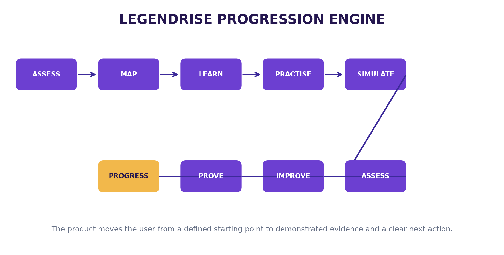
*Figure 1. LegendRise core progression loop.*

### 1.1 Purpose

Choose what you want to become or build. LegendRise assesses where you are, maps the route, teaches what you need, lets you practise, evaluates your work and continuously tells you what to do next. The product is the progression engine, not the course library: every major learning item connects to a milestone and a practical outcome.

#### Two connected pathways, one engine

| Dimension | Career | Venture |
|---|---|---|
| Destination | Target role/field and desired level | Business objective and venture ambition |
| Baseline | Knowledge, skills, experience, confidence | Founder background, idea, resources, customer hypothesis |
| Roadmap | Skill sequence and milestones | Validation and venture-building sequence |
| Learning | Short lessons and resources | Business-building lessons and guided tools |
| Practice | Workplace tasks | Founder experiments and execution tasks |
| Simulation | AI role-play with client/manager/customer | AI role-play with customer/advisor/stakeholder |
| Assessment | Rubric-based practical evaluation | Evidence and assumption checks |
| Evidence | Projects, simulations, portfolio | Validation findings, model, financial logic, pilot evidence |
| Next action | Recommended next skill/task | Recommended next experiment/action |

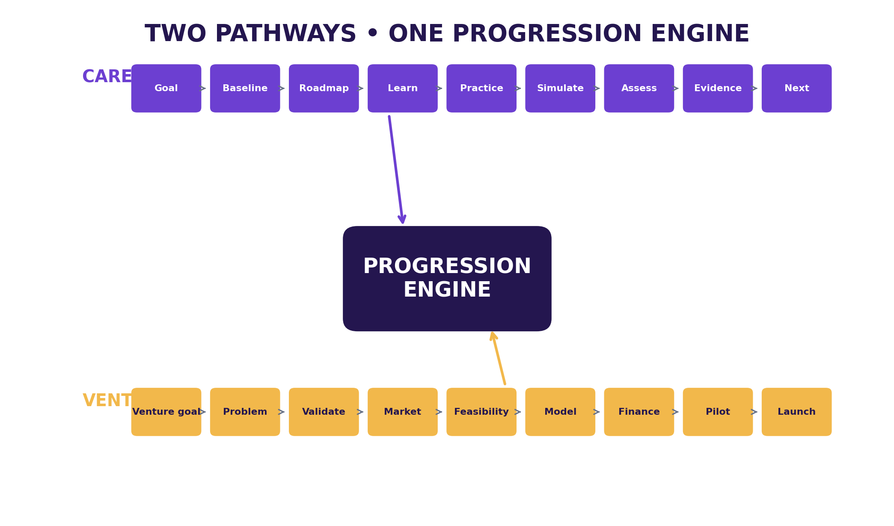
*Figure 2. Two connected pathways sharing one progression engine.*

*Strategic positioning: the product does not claim AI coaching, practical projects, or venture-building are new. Adjacent products already combine these elements, so LegendRise needs a sharper value proposition and disciplined MVP. The differentiation hypothesis → continuous progression toward a defined outcome → requires validation (Eliminate: course completion as success; Reduce: long passive lectures; Raise: personalisation, practical work, feedback, continuity, evidence; Create: the progression engine).*

### 1.2 Target Audience

| Priority | User | Problem to test |
|---|---|---|
| P1 | Early-career Nigerian professional/graduate | Knows the career direction but not the sequence of skills, practice and evidence needed to progress. |
| P2 | Aspiring small-business founder | Has an idea but needs structured validation, feasibility, numbers and execution guidance. |
| P3 | Working professional changing/upgrading career | Needs targeted gap closure rather than another general course library. |

Scope warning: do not start with every career, age group and founder type. Validation questions: What were you trying to achieve before LegendRise? What was hardest? What did it do that a normal course did not? Which part was most useful (learning, practice, simulation, feedback, roadmap)? What would make you stop? Would you pay for the complete journey, and what would you expect in return?

### 1.3 Design Principles (non-negotiables)

1. The product is the progression engine, not the course library.
2. Every major learning item connects to a milestone and a practical outcome.
3. Assessment relies on explicit rubrics and sufficient evidence; AI never independently marks required milestones complete.
4. AI is separated into testable services, never one giant prompt.
5. High-impact progression decisions have deterministic rules around the model.
6. The tutor is grounded in approved LegendRise curriculum content; uncertainty is shown where evidence is insufficient.
7. Do not build the ecosystem before the core progression loop works.
8. Collect only information necessary for the journey; protect private records.
9. Never present AI output as guaranteed career, salary, employment, funding or business outcomes (no-hallucination rule).
10. MVP discipline: one career pathway first; Venture = architecture only.
11. Without database row-level security, every server query on user-owned data MUST be scoped to the session user.

### 1.4 Architecture

Layered web architecture. Product layers and MVP status:

| Layer | Core responsibility | MVP status |
|---|---|---|
| Experience | Learner/admin interfaces | Build |
| Destination | Career goal or venture goal | Build |
| Baseline | Starting-state diagnostic | Build for Career |
| Roadmap | Ordered milestones and actions | Build |
| Learning | Lessons and resources | Build |
| Practice | Realistic work tasks | Build |
| Simulation | AI role-play | Build one high-quality scenario |
| Assessment | Rubric-based evaluation | Build |
| Evidence | Portfolio/capability evidence | Build |
| Next action | One clear next step | Build |
| Venture Lab | Founder validation and execution | Architecture + later release |

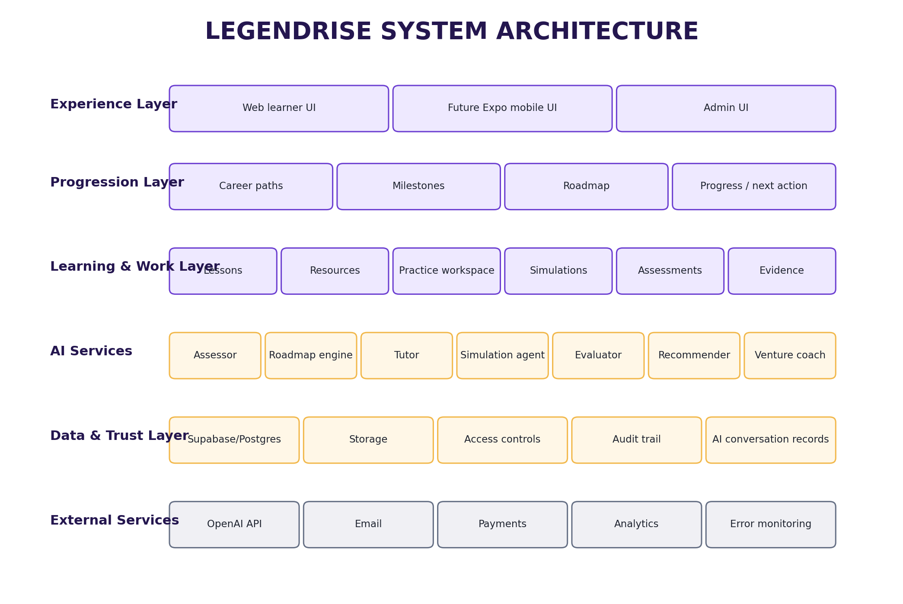
*Figure 7. Layered system architecture.*

Decided stack (founder decision; see Appendix D, Change 1): Next.js (App Router, TypeScript) self-hosted on local device; local PostgreSQL + Prisma ORM/migrations; Better Auth (Prisma adapter); Cloudflare R2 (S3-compatible) storage; Resend email. No Supabase. No Vercel. All AI calls server-side via API routes; keys never reach the browser.

### 1.5 Technical Requirements

#### Data model (all entities)

```
User { id, name, email, emailVerified, image, isAdmin }
Profile { userId, goalType: CAREER|VENTURE, targetRole, currentLevel, experience, preferences, availabilityHoursPerWeek }
CareerPath { id, name, description, levels, isPublished }  Milestone { careerPathId, order, level, title, objectives }
Lesson { milestoneId, title, text, mediaUrl(R2), resources, version, isPublished }
Simulation { milestoneId, scenario(Appendix B), rubricId, isPublished }
Assessment { milestoneId, task, rubric(Appendix C), passRule, isPublished }
Submission { userId, assessmentId, content, score, feedback, version }
Evidence { userId, type, title, source, fileKey(R2), status }
Progress { userId, milestoneId, status, score, completedAt }
VentureProject { userId, stage, status, brief }  VentureEvidence { projectId, type, source, result }
AiConversation { userId, contextType, contextId, messages }  Subscription { userId, plan, status, providerReference }
```

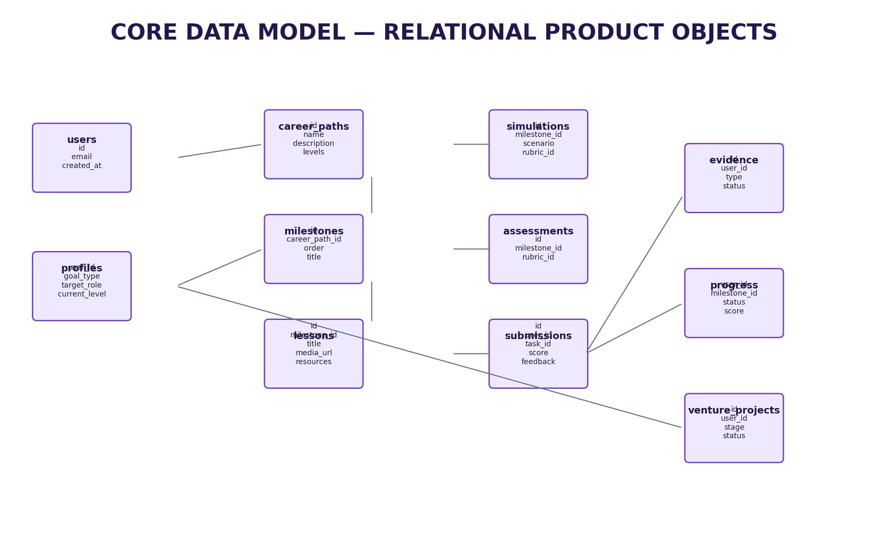
*Figure 8. Core relational data objects.*

#### AI services (separate, testable; JSON in/out; versioned prompts)

| AI service | Input | Output | Control |
|---|---|---|---|
| Career assessor | Goal + responses + experience | Starting profile + gaps | Defined scoring/uncertainty |
| Roadmap engine | Starting profile + career template | Milestones + ordered actions | Approved pathway data |
| Tutor | Current lesson + approved content + question | Grounded explanation | Content grounding |
| Simulation agent | Scenario + role + rubric + user response | Role response + state + coaching | Scenario boundaries |
| Assessment evaluator | Submission + rubric | Score + evidence + feedback | Rubric authoritative |
| Next-step recommender | Progress + scores + unfinished tasks | Next milestone + reason | Evidence-based rule |
| Venture coach | Venture stage + evidence | Next experiment/decision | Evidence/assumption distinction |

AI request lifecycle: identify context → retrieve only approved context → structured input to one AI function → validate output schema → apply deterministic rules → store result + audit info → show uncertainty → allow reporting incorrect output. Secrets server-side; grounded tutor; explicit fallback/uncertainty responses; auditability; report-incorrect-output control.

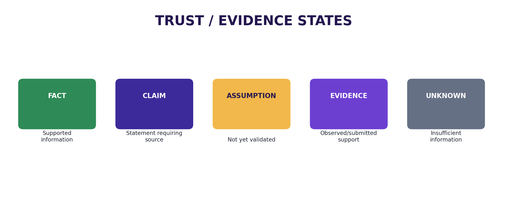
*Figure 9. Trust states preventing assumptions from being presented as verified facts.*

#### Analytics event taxonomy (all phases)

| Event | Trigger |
|---|---|
| signup | Account created |
| assessment_started / assessment_completed | Baseline opened / submitted |
| roadmap_viewed | Roadmap opened |
| lesson_started / lesson_completed | Lesson opened / completion recorded |
| practice_started / practice_submitted | Practice task opened / submission created |
| simulation_started / simulation_completed | Simulation session started / completed |
| assessment_submitted | Practical assessment submitted |
| portfolio_item_created | Evidence item saved |
| ai_coach_opened | AI Coach opened |
| next_action_clicked | Recommended next action started |

| Metric | Definition |
|---|---|
| Activation | % of signups who complete starting assessment and view roadmap |
| Lesson completion | % who finish lesson after starting |
| Practice completion | % who submit practical task |
| Simulation completion | % who complete full simulation |
| Assessment improvement | Change from initial to revised score where applicable |
| Next-step click-through | % who start recommended next action |
| Weekly active learners | Users returning and performing meaningful action in a week |
| Path completion | Users reaching defined endpoint for MVP pathway |

### 1.6 Non-Functional Requirements

| Area | Requirement |
|---|---|
| Security | Server-side secrets; input validation; app-level authorization (every user query scoped to session); private AI conversations never exposed |
| Performance | Core journey usable on ordinary mobile-web conditions; exact targets set by performance testing |
| Availability | Local-first build; production hosting/recovery targets defined before any public launch |
| Maintainability | Modular services; documented code; data-driven career templates (new careers via config, never rewrites) |
| Scalability | Additional careers added through data/content configuration |
| Observability | Analytics + error monitoring present before any external testing |
| Privacy | Consent/notice before collecting data at scale; users access only authorised records; audit fields; retention/deletion rules documented; report-incorrect-output channel |

---
## 2. Phase 1 — MVP: One Career Pathway

**Goal: ship one complete, validated career journey — baseline → roadmap → learning → practice → simulation → rubric assessment → evidence → next action — for a single frozen career, with real users.**

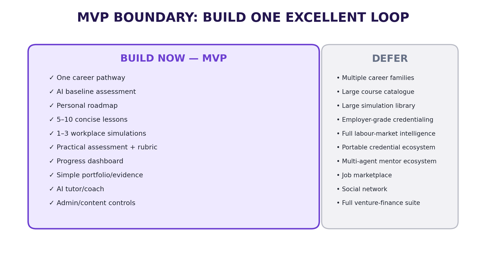
*Figure 3. MVP boundary (build now vs build later).*

| Build now | Build later |
|---|---|
| One career pathway | Multiple career families |
| AI baseline assessment | Advanced psychometrics |
| Personal roadmap | Full adaptive learning graph |
| 5-10 concise lessons | Large course catalogue |
| 1-3 workplace simulations | Large simulation library |
| Practical assessment + rubric | Employer-grade credentialing |
| Progress dashboard | Full labour-market intelligence |
| Simple portfolio/evidence | Portable credentials ecosystem |
| AI tutor/coach | Multi-agent mentor ecosystem |
| Venture architecture (tables + nav stubs) | Full Venture Lab |

#### MVP entry gates (all required before build)

| Gate | Requirement | Evidence |
|---|---|---|
| Entry | One career selected and frozen for the build cycle | Approved career definition |
| Entry | First 10 learning/practice items defined | Content inventory |
| Entry | Core screens specified | UI specification |

#### MVP exit gates (all required before calling MVP done)

| Gate | Requirement | Evidence |
|---|---|---|
| Exit | New user can complete the full core flow | Observed end-to-end test |
| Exit | Assessment produces rubric-linked feedback | Evaluation test |
| Exit | Evidence can be saved | Portfolio test |
| Exit | Dashboard shows one clear next action | Usability test |
| Exit | Real users have tested the product | Validation log |

### 2.1 Features

#### Journey & accounts

| Feature | Description | Priority |
|---|---|---|
| FR-001 Authentication | Email sign-up/login, verification, password reset, basic profile (Better Auth) | P0 |
| FR-002 Onboarding | Collect goal, current level, experience, preferences, availability | P0 |
| FR-003 Career selection | Select/enter target career and level (CAR-01: goal stored, visible on dashboard) | P0 |
| FR-004 Baseline | Structured short assessment with stored responses; gaps + uncertainty flagged (CAR-02) | P0 |
| FR-005 Roadmap | Data-driven ordered milestones from template + profile (CAR-03) | P0 |
| FR-013 Progress | Milestone status, scores, evidence (CAR-10: one obvious next action) | P0 |
| FR-018 Venture architecture | Tables + navigation stubs behind flag; no venture UI | P0 |

#### Learning, practice, simulation

| Feature | Description | Priority |
|---|---|---|
| FR-006 Lesson player | Text, narrated media (slides + voice-over, no face-camera), screen demo, resources, notes, completion (CAR-04) | P0 |
| FR-007 Resource access | Download/open linked resources; typed resources (guide, template, checklist, worked example, case study, worksheet, download pack, tool) with version/owner/review-date | P0 |
| FR-008 Practice workspace | Task brief, work area, hints, submission (CAR-05) | P0 |
| FR-009 Simulation | One high-quality AI role-play: defined scenario, AI role, task, conversation, finish, feedback, retry (CAR-06) | P0 |
| FR-015 AI Coach | Contextual tutor grounded in current lesson + approved curriculum | P0 |

#### Assessment, evidence, portfolio

| Feature | Description | Priority |
|---|---|---|
| FR-010 Assessment | Practical task + explicit rubric (CAR-07: score and feedback map to criteria) | P0 |
| FR-011 Feedback | Score, evidence, improvement actions | P0 |
| FR-012 Retry | Resubmission/versioning where configured (CAR-08) | P0 |
| FR-014 Portfolio | Simple public/private evidence page; completed work becomes evidence (CAR-09) | P0 |
| FR-016 Admin (MVP slice) | Careers, milestones, lessons, simulations, assessments, rubrics CRUD + publish states | P0 |
| FR-017 Analytics (MVP slice) | Core product events (Section 1.5 taxonomy) | P0 |

Deferred by rule: FR-019 payments (after validation), FR-020 mobile (post-web stabilisation).

### 2.2 User Experience

#### User Flow 1: First-day progression (Welcome → Next)

1. User opens app → chooses Career → journey explained, goal collected (Goal record).
2. Selects/enters target career and level (Career target).
3. Completes short diagnostic; system estimates level/gaps and marks uncertainty (Starting profile).
4. Reviews staged path; system sequences learning/practice (Roadmap).
5. Completes lesson; tutor answers within lesson context (Learning activity).
6. Completes realistic task with brief, workspace, hints, submission (Work product).
7. Performs AI role-play as client/manager/customer scenario (Simulation result).
8. Submits work; system scores against explicit rubric (Assessment).
9. Revises with targeted feedback (Improved submission).
10. Saves work as tagged capability evidence (Evidence).
11. Takes next milestone from evidence-based recommendation (Next action).

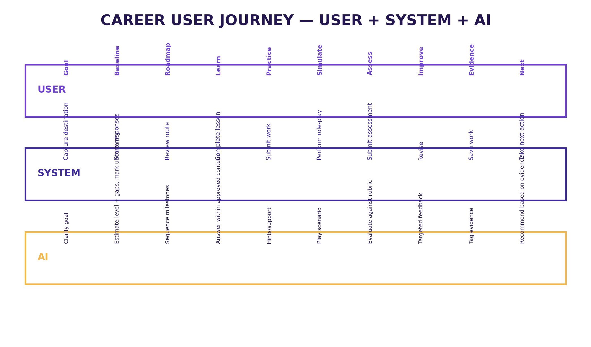
*Figure 4. Career journey as a coordinated user, system and AI workflow.*

#### User Flow 2: Returning learner

1. User opens dashboard → sees current path, level/progress, ONE recommended next action.
2. Continues learning or upcoming assessment; opens AI Coach entry point when stuck.
3. Submits practice → receives rubric feedback → retries → evidence snapshot grows.

#### User Flow 3: Evidence check

1. User opens portfolio → sees projects, simulations, capabilities with status (Not assessed / Developing / Demonstrated / Needs review).
2. Taps an item → traces it back to source work and rubric scores.

#### Screens (10 MVP screens)

| Screen | Purpose | Core components |
|---|---|---|
| Landing | Explain value and convert visitor | Career/Venture choice, outcomes, CTA |
| Onboarding | Understand user | Goal, current level, experience, preferences |
| Dashboard | Show what matters now | Current path, progress, next action, AI coach, quick actions |
| Career Path | Show route | Milestones, levels, completed/in-progress/locked states |
| Lesson | Teach | Player, notes, resources, AI tutor, next action |
| Practice | Turn learning into work | Brief, workspace, hints, submit |
| Simulation | Role-play | Scenario, AI role, task, conversation, finish, feedback, retry |
| Assessment | Measure capability | Task, submission, rubric, score, feedback, evidence |
| Portfolio | Show evidence | Projects, simulations, certificates, capabilities |
| AI Coach | Contextual support | Chat, recommendations, explanation |

Responsive breakpoints: Mobile < 640px; Tablet 640–1024px; Desktop > 1024px. Core journey must work on desktop AND mobile web before any native release.

### 2.3 Technical Details

#### Build sequence (executed in order)

| Step | Workstream | Output |
|---|---|---|
| 1 | Product workspace | Project repo, README (purpose/scope/stack/rules), decision register |
| 2 | Freeze MVP | One career, journey, success metric, first 10 learning/practice items |
| 3 | Design screens | 10 MVP screen specs (design phase — on hold) |
| 4 | Authentication | Better Auth email sign-up/login, verification, reset, profile |
| 5 | Data model | Prisma schema + migrations + seed (Section 1.5 entities) |
| 6 | Onboarding | Goal, level, experience, preferences, availability |
| 7 | Roadmap | Assessment outputs → ordered milestones stored as data |
| 8 | Content delivery | Lesson pages: narrated media (R2), text, resources, completion |
| 9 | AI tutor | Grounded in current lesson + approved curriculum |
| 10 | Practical work | Task page, submission area, rubric |
| 11 | Simulation | One high-quality workplace scenario with role, response, feedback |
| 12 | Progress | Milestone completion, scores, evidence, one next action |
| 13 | Portfolio | Simple public/private evidence page |
| 14 | Venture architecture | Tables + nav stubs behind flag |
| 15 | Real-user testing | Observe actual usage (Appendix C protocol) |
| 16 | Fix weakest point | Improve onboarding, roadmap, lessons, simulation or assessment from behaviour |
| 17 | Local release | Stable build; desktop + mobile browser tested |

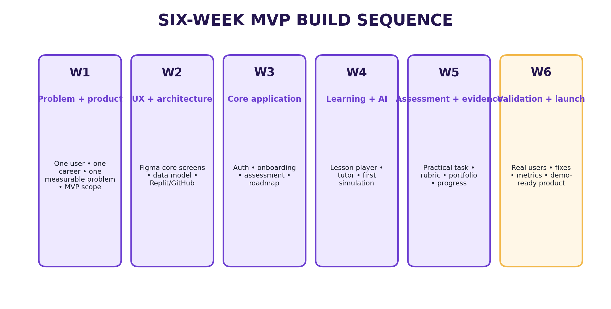
*Figure 10. MVP build sequence.*

#### Resource workflow

Create → Review → Tag → Publish → Link to milestone/task → Track usage → Review performance → Update/archive. Every published item has an owner and review status; retired content stays traceable; external facts carry source records; AI drafts require human review.

#### Lesson content specification (per lesson)

Learning objective; five-minute voice-over script; visual/slide sequence; screen-demo plan; one worked example; one practice task; one realistic workplace scenario; five-question knowledge check; assessment rubric; downloadable worksheet/template; common mistakes; next milestone.

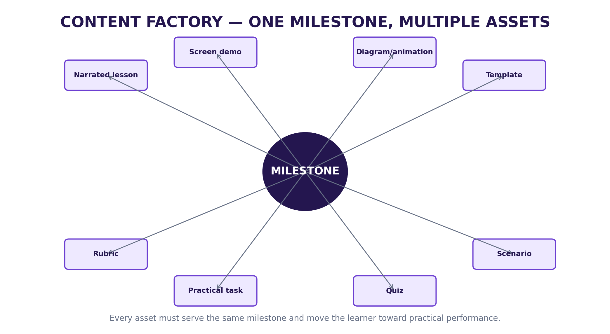
*Figure 5. Content factory: each milestone produces coordinated learning + action assets.*

#### Evidence loop & capability states

| Capability status | Meaning | Progression behaviour |
|---|---|---|
| Not assessed | No sufficient evidence | Do not infer capability |
| Developing | Some evidence, not yet sufficient/consistent | Recommend targeted practice |
| Demonstrated | Evidence meets configured rubric | Allow configured milestone progression |
| Needs review | Ambiguous/exceptional case | Request more evidence or human review |

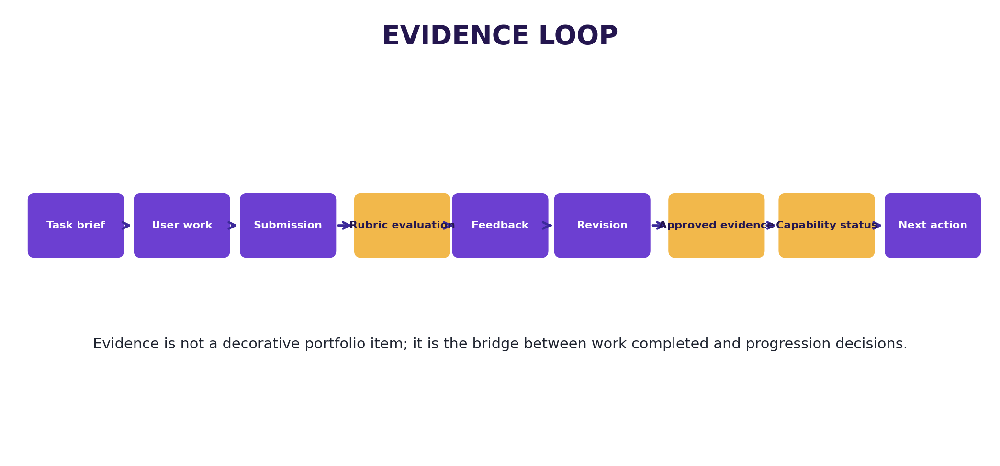
*Figure 6. Evidence loop connecting practical work to progression.*

### 2.4 Design System (structure; brand values TBD in design phase)

*Direction (specified): premium, calm, modern education/productivity experience — clean cards, clear progress states, strong typography, accessible contrast, no decorative clutter. The product font and brand palette are selected during the design phase (currently on hold); the token tables below define the REQUIRED STRUCTURE with specified interaction rules. TBD = to be defined, never invented ad hoc.*

#### Required color token structure (values TBD except usage rules)

| Token | Value | Usage |
|---|---|---|
| --color-primary | TBD (brand) | Primary actions, links, focus states |
| --color-success | TBD (brand) | Demonstrated capability, success states |
| --color-warning | TBD (brand) | Needs-attention states |
| --color-error | TBD (brand) | Destructive actions, validation errors |
| --color-text-primary | TBD (contrast-checked) | Primary text |
| --color-text-secondary | TBD (contrast-checked) | Secondary text |
| --color-surface | TBD | Backgrounds, cards |
| --color-border | TBD | Borders, dividers |
| --state-completed | TBD (visually distinct) | Completed milestones |
| --state-in-progress | TBD (visually distinct) | In-progress milestones |
| --state-locked | TBD (visually distinct) | Locked milestones |
| --state-needs-attention | TBD (visually distinct) | Needs-attention + evidence states |

#### Required type / spacing / radius / shadow structure (values TBD)

| Token | Value | Usage |
|---|---|---|
| --font-sans | TBD (accessible product font) | All UI text |
| --font-mono | TBD | Scores, dates, IDs |
| --text-xs/sm/base/lg/xl/2xl/3xl | TBD scale | Captions → dashboard totals |
| --space-1..12 (4px base) | TBD scale | Tight spacing → section spacing |
| --radius-sm/md/lg/xl/full | TBD | Tags → pills, badges |
| --shadow-sm/md/lg | TBD | Subtle elevation → modals |

#### Accessibility (WCAG 2.1 AA, specified)

Readable contrast; clear labels; keyboard/touch usability; meaningful error states; focus management in modals; screen-reader compatible dynamic updates; reduced-motion respected.

### 2.5 Success Metrics (MVP)

| Metric | Target |
|---|---|
| Activation (signup → assessment → roadmap) | Baseline + improvement vs control cohort |
| Lesson completion | Measured; weakest point fixed before adding features |
| Practice submission rate | Measured per milestone |
| Simulation completion + realism rating | Users describe scenario as useful and realistic |
| Assessment improvement (first → revised) | Performance/clarity improves after feedback |
| Next-step click-through | Users voluntarily continue beyond one lesson |
| Retention (return to next milestone) | Voluntary continuation observed |

### 2.6 Acceptance Criteria (MVP)

- A new user can create an account, choose a career, complete the baseline, and receive a roadmap — observed unaided.
- User can complete a lesson (text, narrated media, demo, resources) and submit a practical task.
- User can complete one AI simulation scenario end-to-end with feedback and retry.
- Assessment score and feedback map explicitly to rubric criteria; resubmission versions stored.
- Completed work can be saved as evidence; portfolio shows it with capability status.
- Dashboard shows one obvious, actionable next step.
- Tutor answers only from current lesson + approved curriculum; reports of incorrect output are receivable.
- No AI output promises jobs, salaries, certification, funding or business outcomes.
- Core journey works on desktop and mobile web; all interactive elements keyboard accessible.

---
## 3. Phase 2 — Depth & Scale

**Goal: from one validated pathway to multiple careers with deeper personalisation and richer evidence — only after Phase 1 exit gates are green.**

### 3.1 Features

| Feature | Description | Priority |
|---|---|---|
| Multiple career families | New careers added through data/content configuration, never rewrites | P0 |
| Richer portfolio/evidence | Portable evidence views; employer-facing summaries (no credential claims beyond evidence) | P0 |
| Simulation library | Additional workplace scenarios per milestone, Appendix B spec each | P1 |
| Adaptive progression graph | Deeper personalisation of sequence from performance data | P1 |
| Advanced assessments | Cross-milestone practicals; human-review queue for Needs-review cases | P1 |
| Cohort features | Study groups / peer review (only if retention data demands it) | P2 |

### 3.2 User Experience

1. Returning learner picks up a second career → baseline recognises transferable demonstrated capabilities.
2. Portfolio reader (e.g., hiring manager) opens a shared evidence link → sees work samples with rubric scores, never inflated claims.
3. Learner retries across an expanded simulation library with consistent feedback quality.

### 3.3 Technical Details

Career template system: Appendix A template drives seeding; versioned rubrics with effective dates; AI config (prompts + grounding sources + history) managed in admin; analytics funnel/retention/pathway views extended.

### 3.4 Success Metrics

| Metric | Target |
|---|---|
| Second-career uptake | Measured among path completers |
| Portfolio shares/views | Evidence accessed by third parties |
| Simulation coverage | ≥ 3 scenarios per core milestone family |

### 3.5 Acceptance Criteria

New career ships via content rows only (zero code changes); rubrics versioned with effective dates; portfolio evidence traceable to source work; no capability inferred without evidence.

---

## 4. Phase 3 — Venture Lab + Polish

**Goal: build the founder pathway on the proven engine, and harden the product (settings, accessibility, trust, go-live gate).**

### 4.1 Features

| Feature | Description | Priority |
|---|---|---|
| Venture goal + problem | Structured idea brief; problem hypothesis + test questions | P0 |
| Customer validation | Guided interview/test scripts + evidence log | P0 |
| Market workbench | Competitor, price, demand evidence capture | P0 |
| Feasibility workbench | Operating requirements, constraints, risks | P0 |
| Business model + financial logic | Value proposition, revenue logic; pricing/volume/cost/funding assumptions + scenarios | P0 |
| Business plan assembler | Plan generated FROM gathered evidence, never as a substitute for validation | P1 |
| Pilot checklist + learning loop | Small controlled launch/test | P1 |
| Settings & preferences | Profile, notifications, theme, accessibility options | P1 |
| Accessibility hardening | Full WCAG 2.1 AA audit + remediation; keyboard paths; screen-reader flows | P0 |
| Trust & safety | Report-incorrect-output on all AI surfaces; consent/privacy controls; retention/deletion self-service | P0 |

#### Venture evidence rules (hard rules)

Separate assumptions from evidence; store source/origin of validation evidence; never let AI convert a plausible statement into a verified market fact; financial outputs identify assumptions + scenarios; plan generation only after evidence.

### 4.2 User Experience (founder flow)

1. Founder describes idea + target customer → structured idea brief.
2. Defines problem → hypothesis + test questions.
3. Runs guided interviews → evidence log grows.
4. Researches market/feasibility → structured evidence.
5. Models business + financials → assumption/scenario views.
6. Assembles plan from evidence → runs pilot checklist.

### 4.3 Go-live gate (all areas must be Done before controlled launch)

| Area | Done when |
|---|---|
| Product | Core journey works end-to-end without manual intervention |
| AI | Prompts tested, grounded, with failure behaviour |
| Content | First career path has enough lessons/tasks to complete MVP |
| Assessment | Rubric gives consistent, understandable feedback |
| Data | User records protected; backup/recovery approach exists and is tested |
| Analytics | Core product events captured |
| Support | User can report a problem or incorrect AI feedback |
| Payments | Enabled only after commercial validation + webhook testing |
| Mobile | Native build tested on real devices (post-web phase only) |
| Legal | Privacy policy, terms, consent reviewed before collecting data at scale |

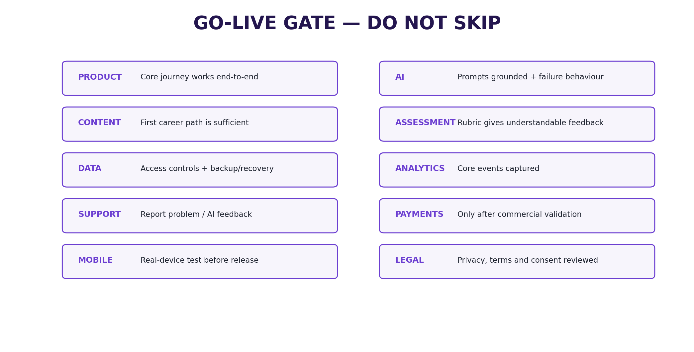
*Figure 11. Go-live gate.*

### 4.4 Success Metrics

| Metric | Target |
|---|---|
| Venture stage completion | Founders advance with logged evidence per stage |
| Assumption-to-evidence ratio | Tracked per project; assumptions visibly shrinking |
| Accessibility audit | 100% WCAG 2.1 AA on core flows |
| Support responsiveness | Report channel acknowledged within defined SLA |

### 4.5 Acceptance Criteria

Founder journey runnable end-to-end with evidence log; no market 'fact' without a stored source; plan document assembles only from existing evidence; accessibility audit clean; go-live gate table fully signed off.

---

## 5. Phase 4 — Future Platform

**Goal: ecosystem expansion — only after a validated engine, venture loop, and commercial signal.**

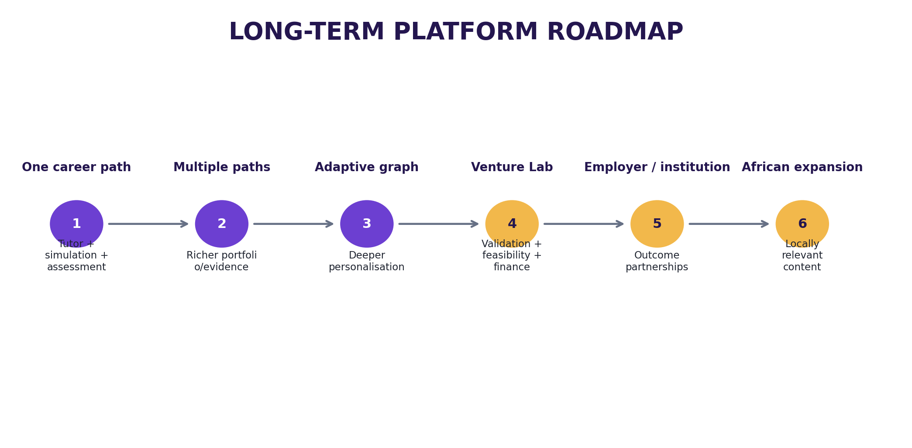
*Figure 12. Long-term platform evolution.*

| Stage | Platform evolution | Notes |
|---|---|---|
| 1 | One career path + AI tutor + simulation + assessment | Phase 1 (done) |
| 2 | Multiple career paths + richer portfolio/evidence | Phase 2 (done) |
| 3 | Adaptive progression graph + deeper personalisation | Phase 2 (done) |
| 4 | Venture Lab with validation, feasibility, financial modules | Phase 3 (done) |
| 5 | Employer/institutional pathways and outcome partnerships | Phase 4 — cohort/institution licences; human coaching add-on |
| 6 | Broader African expansion with locally relevant content | Phase 4 — timing contingent on validation + resources |

#### Commercial model (hypotheses, not validated revenue)

| Revenue stream | Approach | Timing |
|---|---|---|
| Freemium | Free diagnostic + limited starter journey | After MVP validation |
| Premium pathway | Paid full career pathway | Early commercial test (real purchase, not stated intent) |
| Venture pathway | Paid structured founder journey | After career engine proves useful |
| Cohort/institution | Licences to training organisations/employers | Later |
| Coaching add-on | Human expert support | Later |

**Commercial discipline: no complex subscription system before users complete the core journey and value it. Payment follows demonstrated value.**

#### Mobile release sequence (post-web stabilisation)

1. Develop/test through Expo → 2. internal/closed testing → 3. fix crashes/permissions/onboarding → 4. store assets + privacy policy + description → 5. authorised developer/organisation account → 6. submit after MVP stable → 7. monitor releases + feedback. Re-check current store fees/policies before submission.

---

## 6. Risks & Mitigations

| Risk / dependency | Likelihood | Impact | Mitigation | Phase |
|---|---|---|---|---|
| Feature sprawl; MVP grows too broad | High | High | Freeze MVP boundary; entry/exit gates | 1 |
| Unvalidated career choice | Medium | High | Validate before deep content build | 1 |
| AI hallucination / incorrect guidance | Medium | High | Grounding + uncertainty + eval tests + reporting | 1-3 |
| Weak rubric; capability claims lack credibility | Medium | High | Author + version rubrics; human review | 1-2 |
| Content overload; consume but never practise | Medium | Medium | Tie every item to tasks/milestones | 1-2 |
| Low retention; journey abandonment | Medium | High | Observe; fix weakest point before features | 1-2 |
| Premature payments complexity | Low | Medium | Delay billing until commercial validation | 3-4 |
| Privacy failure; trust/data risk | Low | High | App-level scoping tests; privacy by design; audit | 1-3 |
| Vendor cost changes | Medium | Medium | Re-check pricing (R2/PostHog/Resend/OpenAI) pre-launch | 3 |
| Local data loss (self-hosted DB) | Low | High | Scheduled pg_dump; restore drill | 1-3 |
| No public URL blocks external testing | High | Medium | Local-network testing; VPS in Phase 4 | 2-3 |
| App-store delay blocks mobile | Medium | Low | Stabilise web first | 4 |

#### Key dependencies (needed before)

| Dependency | Needed before |
|---|---|
| Selected first career | Career content build |
| Career template | Roadmap engine |
| Approved curriculum | Grounded tutor |
| Rubric | Assessment evaluator |
| Simulation scenario | Simulation agent |
| Content/resources | Lesson + practice release |
| Analytics events | External testing |
| Privacy/terms language | Scaled data collection |
| Payment validation | Commercial build |

---
## 7. Appendices

### Appendix A — Product glossary

| Term | Meaning |
|---|---|
| Progression engine | The shared system moving users through defined stages |
| Milestone | A meaningful stage in a journey |
| Capability | An ability the user is expected to demonstrate |
| Evidence | Work or assessment information supporting a capability state |
| Simulation | Controlled AI role-play used for practice |
| Roadmap | Ordered sequence of milestones/actions |
| Resource | Reusable material supporting learning or execution |
| Rubric | Explicit criteria used to evaluate performance |
| Grounding | Constraining AI responses to approved context/data |
| Next action | The immediate recommended task or milestone |
| Venture evidence | Information supporting a venture assumption or decision |

### Appendix B — Specification templates

#### B1. Career pathway template

| Field | Definition |
|---|---|
| Career name / Target level / Destination | Approved title, level, what the user works toward |
| Baseline criteria | What the diagnostic measures |
| Milestones / Lessons / Practice tasks / Simulations | Ordered stages + items per stage |
| Assessment / Evidence / Next action | Rubric + completion rule; what is saved; how progression is determined |

#### B2. Simulation specification

| Field | Definition |
|---|---|
| Scenario background / Learner role / AI role / Goal | Context; who the user is; client/manager/customer/colleague; desired outcome |
| Initial state / Possible responses / Hidden state variables | Starting condition; dynamic branches; scenario state |
| Good performance / Rubric criteria / Failure modes | Observable behaviours; evaluation dimensions; how it can go wrong |
| Completion condition / Feedback format | When simulation ends; evidence-linked feedback |

#### B3. Assessment specification

| Field | Definition |
|---|---|
| Task / Evidence required / Criteria / Levels | What the learner produces; minimum evidence; what is judged; meaning of each level |
| Scoring / Feedback / Retry / Evidence save rule | How results are represented; improvement guidance; whether/when allowed; when work enters portfolio |

#### B4. Lesson specification (content factory)

Learning objective; five-minute voice-over script; visual/slide sequence; screen-demo plan; one worked example; one practice task; one realistic workplace scenario; five-question knowledge check; assessment rubric; downloadable worksheet/template; common mistakes; next milestone.

#### B5. Resource types

| Resource type | Purpose | Required fields |
|---|---|---|
| Guide | Explain a concept/process | Title, description, stage, capability, version, owner, review date |
| Template | Enable action | Purpose, instructions, format, related task |
| Checklist | Support execution | Stage, checklist items, version |
| Worked example | Show how a task can be approached | Context, task, example, limitations |
| Case study | Connect learning to a scenario | Context, source, learning points |
| Worksheet | Capture user work | Inputs, instructions, output |
| Download pack | Bundle milestone assets | Included assets, version |
| Tool/calculator | Support structured calculation | Inputs, assumptions, outputs |

### Appendix C — Admin, testing & launch checklists

#### C1. Admin objects (Phase 1 slice → full CMS by Phase 2)

| Admin object | Required controls |
|---|---|
| Career path | Create/edit/publish/archive; levels; description |
| Milestone | Order; objectives; linked lessons/tasks/assessment |
| Lesson | Text/media; resources; version; publish state |
| Resource | File/link; tags; owner; review date; version |
| Simulation | Scenario; AI role; rubric; completion condition |
| Assessment | Task; rubric; pass/completion rule |
| Rubric | Criteria; levels; version; effective date |
| User | Access state; journey state; support status |
| Analytics | Funnel, retention, pathway metrics |
| AI configuration | Service prompts, grounding sources, version history |

#### C2. Testing & validation plan

| Test | Method | Success signal |
|---|---|---|
| Problem validation | Interview 10-20 target users | Same progression problem heard in their own words |
| Usability | Observe 5-10 users completing onboarding | Most reach roadmap without explanation |
| Learning value | Compare first and revised submissions | Performance/clarity improves after feedback |
| Simulation value | Users complete AI scenario | Described as useful and realistic |
| Retention | Observe return to next milestone | Voluntary continuation beyond one lesson |
| Payment signal | Paid pathway with small group | Real purchase, not stated intent |

Test protocol: recruit matching segments; give a realistic goal, not screen tours; observe hesitation/abandonment; record completion + qualitative feedback; positive statements alone are not proof of payment willingness; log every finding in the decision register; fix the weakest point before adding features.

#### C3. MVP Definition of Done (all ten, observed)

| # | A new user can... | Verification |
|---|---|---|
| 1 | Create an account | Observed test |
| 2 | Choose a career | Observed test |
| 3 | Complete the baseline | Observed test |
| 4 | Receive a roadmap | Observed test |
| 5 | Complete a lesson | Observed test |
| 6 | Complete a practical task | Observed test |
| 7 | Use an AI simulation | Observed test |
| 8 | Receive rubric-based evaluation | Evaluation test |
| 9 | Save evidence | Portfolio test |
| 10 | See a clear next action | Dashboard test |

**If any of the ten cannot be completed reliably, remain in build/test: no additional careers, social features, marketplace, or venture ecosystem.**

### Appendix D — Change Log

#### Change 1: Replaced hosted stack with founder-decided local stack

**Date: 2026-09-26. Requested by: Founder.**

Reason: operate the MVP at zero platform cost on the founder's own device; keep data local; avoid hosted-service subscriptions during validation.

- Replit (build env) → local-first build (VS Code + GitHub).
- Supabase (Auth/Postgres/storage) → local PostgreSQL + Prisma ORM; Better Auth (Prisma adapter); Cloudflare R2 storage.
- Vercel (hosting) → self-hosted on local device (next dev / next start); public hosting deferred to Phase 4 (VPS).
- Added: app-level authorization rule (every user query scoped to session) replacing database row-level security; scheduled pg_dump backups; R2 presigned URLs for private evidence.
- Impact: Phase 1 build sequence, Section 1.4/1.5/1.6, and go-live gate updated; no product-scope change.

#### Change 2: Restyle + expand to v2.1 (tutor-guided format)

**Date: 2026-09-26. Requested by: Founder.**

- Reorganised the full v2.0 content into Overview + phased delivery (Phases 1-4) mirroring the approved PRD-writing guide.
- Added: feature tables with P0/P1/P2 priorities; user flows; technical build sequence; design-token structure (brand values TBD in design phase, never invented); per-phase success metrics and acceptance criteria; risks table with likelihood/impact; specification templates appendix.
- Preserved: all product facts, both journeys, all requirements (FR-001..020, CAR-01..10), AI services, data model, analytics taxonomy, admin, content factory, validation plan, monetisation hypotheses, Definition of Done.
- Re-embedded all 12 original figures at their matching sections.

*Primary source note: v2.0 derived from the supplied LegendRise Career & Venture OS Start-to-Finish Product Build Playbook. Structural additions in v2.1 (IDs, tables, flows, metrics) are product-management scaffolding to make the source executable; commercial figures remain hypotheses until validated.*
